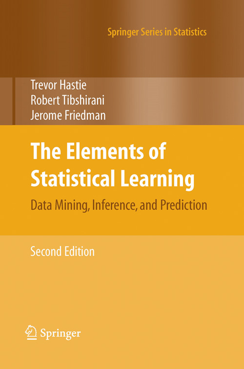
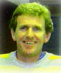
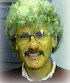

::: {.hero}

::: {style="align-self:center"}

Second edition · corrected 12th printing

# The Elements of Statistical Learning

Data Mining, Inference, and Prediction

A broad, concept-first treatment of statistical learning, richly illustrated with examples.

<a href="https://hastie.su.domains/">Trevor Hastie</a> · <a href="https://tibshirani.su.domains/">Robert Tibshirani</a> · <a href="https://statistics.stanford.edu/people/jerome-h-friedman">Jerome Friedman</a>

<a class="action primary" href="book/index.html">Read and download</a><a class="action" href="errata/">View errata</a>

:::
:::

::: {.quick-grid}
::: {.quick-card}
### Data

Download the datasets used throughout the book, with descriptions and training/test splits.

[Browse datasets →](resources/data.qmd)
:::

::: {.quick-card}
### Errata

Corrections organized by printing, including updates not yet reflected in the online edition.

[Review corrections →](errata/index.qmd)
:::

::: {.quick-card}
### Software

Find related R packages for lasso, boosting, discriminant analysis, principal curves, and more.

[Explore R packages →](resources/packages.qmd)
:::
:::

## About the book

The second edition brings together the important ideas of statistics, data mining, machine learning, and bioinformatics in a common conceptual framework. Its coverage spans supervised and unsupervised learning, including neural networks, support vector machines, trees, boosting, random forests, graphical models, and methods for wide data.

> “...a beautiful book.” — David Hand, *Biometrics*

## Latest

The corrected 12th printing has been available online since January 2017. References in the book to the former Stanford URL should now use `hastie.su.domains/ElemStatLearn`.

[See all news →](news/index.qmd)
